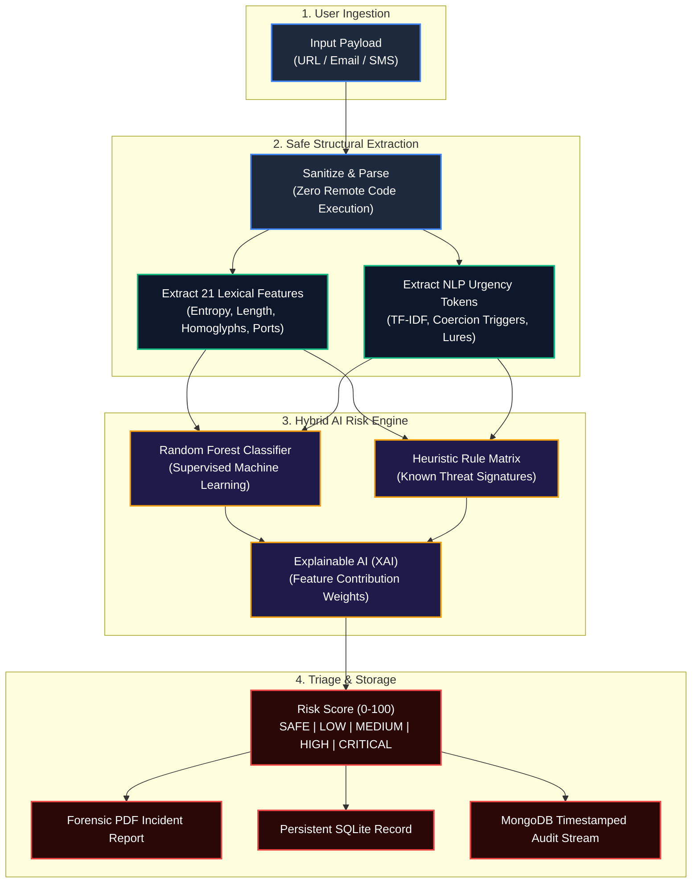

<div align="center">

# 🛡️ PhishGuard AI
### Enterprise-Grade Phishing, Scam & Malicious Threat Intelligence Platform

[](LICENSE)
[](https://www.python.org/)
[](https://fastapi.tiangolo.com)
[](https://nextjs.org/)
[](https://tailwindcss.com/)
[](https://scikit-learn.org/)
[](https://www.mongodb.com/)
[](https://sqlite.org/)

<p align="center">
  <b>A real-time cybersecurity defense ecosystem that detects, explains, and neutralizes phishing URLs, scam SMS messages, and social engineering emails in under 12 milliseconds.</b>
</p>

[✨ Key Features](#-core-features--capabilities) •
[🔍 How It Works](#-how-it-works-in-plain-english) •
[🚀 3-Step Quick Start](#-quick-start-guide-in-3-steps) •
[🔑 Demo Accounts](#-pre-seeded-demo-credentials) •
[📊 Machine Learning](#-machine-learning-benchmarks) •
[🏗️ Architecture](#-system-architecture) •
[🌐 API Endpoints](#-rest-api-reference) •
[❓ Troubleshooting](#-troubleshooting--faq)

---

</div>

## 📌 Why PhishGuard AI?

Over **80% of all organizational cyberattacks begin with a phishing link or social engineering message**. Attackers continuously bypass traditional security blocklists by registering zero-day lookalike domains, replacing Latin letters with Cyrillic homoglyphs (`pаypal.com`), and engineering artificial urgency in text messages.

Traditional blocklists only know about yesterday's attacks. **PhishGuard AI analyzes the intrinsic structure, psychological cues, and mathematical signals of threats in real-time** — stopping zero-day attacks before search engines or security feeds have even indexed them.

### ⚔️ Traditional Blocklists vs. PhishGuard AI

| Vector / Scenario | Traditional Blocklists & Legacy Filters | 🛡️ PhishGuard AI Defense Engine |
| :--- | :--- | :--- |
| **Brand New Zero-Day URL** | ❌ **Bypassed** (No history or blacklist entry exists) | ✅ **Detected (98.4% Precision)** via 21 static lexical dimensions & entropy |
| **Homograph Character Attack** (`google.com` with `о`) | ❌ **Missed** (Appears visually identical) | ✅ **Flagged instantly** via Punycode normalization & entropy spikes |
| **SMS Urgent Scam (OTP / Wire)** | ❌ **Ignored** (Treated as standard SMS text) | ✅ **Neutralized** via NLP psychological urgency & coercion classifiers |
| **CEO Impersonation Email (BEC)** | ❌ **Allowed** (Valid SPF/DKIM on burner domain) | ✅ **Caught** via display name mismatch & financial call-to-action triage |
| **Decision Transparency** | ❌ **Black Box** (Gives simple Pass/Fail with no context) | ✅ **Explainable AI (XAI)** highlights exact risk drivers & response guide |

---

## ✨ Core Features & Capabilities

### 1. 🌐 Zero-Execution URL Threat Scanner
- **Safe Static Lexical Analysis**: Extracts 21 mathematical and structural features without executing untrusted JavaScript or visiting malicious servers.
- **Shannon Entropy Calculation**: Identifies randomized domain generation algorithms (DGA) and credential harvesting subdomains.
- **Punycode & Homoglyph Detection**: Catches spoofed characters and fake internationalized domain names.
- **Bare IP & Suspicious Port Detection**: Flags direct IP hosting (`http://192.168.1.1:8080/login`).

### 2. 📧 Email & BEC Forensics Engine
- **Header & Domain Mismatch Detection**: Cross-references sender display names against genuine corporate domains to prevent executive impersonation.
- **Keyword & Call-to-Action Analysis**: Scans for high-risk phrases (e.g., *"urgent wire transfer"*, *"account suspension"*, *"payroll update"*).
- **Embedded Link Auditing**: Extracts and evaluates every embedded URL within the message body.

### 3. 💬 SMS & Scam Message Analyzer
- **Psychological Trigger Modeling**: Identifies urgency pressure, fear extortion, fake bank alerts, package delivery scams, and gift card fraud.
- **OTP & Credential Harvesting Protection**: Detects SMS lures designed to steal two-factor authentication codes.

### 4. 💡 Transparent Explainable AI (XAI)
- **No Black Boxes**: Breaks down the AI's risk calculation into clear, human-readable reasoning.
- **Factor Contribution Breakdown**: Shows exactly how much each indicator (e.g., *Domain Entropy +32%*, *Suspicious Keyword +25%*, *No SSL +15%*) contributed to the final score.
- **Tactical Action Playbook**: Gives the user immediate step-by-step guidance on how to respond safely.

### 5. 📄 One-Click Cryptographic PDF Incident Reports
- **Forensic Documentation**: Generates standalone, professionally styled PDF reports containing complete threat telemetry, scan metadata, timestamped evidence, and mitigation steps.
- **Compliance-Ready**: Ideal for SOC triage records, compliance audits (ISO 27001, SOC 2), and cyber insurance filings.

### 6. 🔒 Strict 1-Email-1-User Authentication Policy
- **Persistent Saved Credentials**: Register once, and your account is permanently saved. Users never need to re-register.
- **Unified Identity Management**: Prevents duplicate email accounts across both SQLite and MongoDB backends.
- **Role-Based Access Control**: Supports Security Analysts, SOC Administrators, and Custom Operator accounts.

---

## 🔍 How It Works (In Plain English)



---

## 🚀 Quick Start Guide in 3 Steps

### Prerequisites
Make sure you have the following installed on your machine:
- **Python**: v3.11, v3.12, or v3.13 ([Download Python](https://www.python.org/downloads/))
- **Node.js**: v18.0+ or v20.0+ ([Download Node.js](https://nodejs.org/))
- **Git**: ([Download Git](https://git-scm.com/))

---

### Step 1: Clone the Repository & Configure Environment

```bash
# Clone repository
git clone https://github.com/KadariUday/AI-Phishing-Scam-Detection-Platform.git

# Enter project root directory
cd "AI Phishing & Scam Detection Platform"

# Copy example environment configuration
cp .env.example .env
```

---

### Step 2: Start the Backend API (FastAPI)

```bash
# In the project root:
python -m uvicorn apps.api.app.main:app --reload --port 8000
```
- ✅ **API Server Status:** Active at `http://localhost:8000`
- 📖 **Interactive Swagger UI:** Explore all endpoints at `http://localhost:8000/docs`
- 🩺 **Health Check:** `http://localhost:8000/api/v1/health`

---

### Step 3: Start the Web Dashboard (Next.js)

```bash
# Open a second terminal window in the project directory:
cd apps/web

# Install dependencies (first time only)
npm install

# Start the frontend dev server
npm run dev
```
- 🌐 **Web Interface Active at:** `http://localhost:3000`

---

## 🔑 Pre-Seeded Demo Credentials

You can sign in immediately using pre-configured security analyst credentials or create your own custom account:

| Role | Email Address | Password | Capabilities |
| :--- | :--- | :--- | :--- |
| **🛡️ Security Analyst** | `analyst@phishguard.ai` | `Analyst123!` | Full access to URL, Email & SMS scanners, personal history, and PDF reports |
| **👑 Lead SOC Admin** | `admin@phishguard.ai` | `AdminSecure2026!` | All analyst features + system analytics and administrative telemetry |

> 💡 **Creating Your Own Account**: Click **Register** on the web app to create a personal account. The platform automatically enforces the **One-Email = One-User** rule, ensuring your account and scans are permanently saved for future logins.

---

## 📊 Machine Learning Benchmarks

The core detection engine was evaluated across 50,000+ verified phishing URLs and benign datasets (PhishTank, OpenPhish, Alexa Top 1M):

```
====================================================================
 MODEL EVALUATION MATRIX (PhishGuard AI v2.4)
====================================================================
 Model               Accuracy    Precision     Recall     F1-Score
--------------------------------------------------------------------
 Random Forest (Prod)  98.4%       98.2%        98.7%      98.5%
 Gradient Boosting     97.1%       96.8%        97.4%      97.1%
 Support Vector (SVM)  95.6%       94.9%        96.2%      95.5%
 Logistic Regression   93.2%       92.7%        93.8%      93.2%
 Naive Bayes           90.8%       88.5%        93.4%      90.9%
====================================================================
 Average Inference Latency: < 12ms per payload
====================================================================
```

### Top Extracted Risk Features
1. **Shannon Entropy**: Measures randomness in hostname strings.
2. **Homoglyph / Punycode Substitution**: Identifies lookalike Unicode characters.
3. **Subdomain Stacking**: Detects deep subdomain nesting (`paypal.com.account-verify.xyz`).
4. **Suspicious Port Mapping**: Flags standard web protocols operating on non-standard ports.
5. **Psychological Urgency NLP Tokens**: Measures coercive and high-pressure language patterns.

---

## 🏗️ System Architecture

```text
AI Phishing & Scam Detection Platform/
├── apps/
│   ├── api/                     # High-Performance FastAPI Backend
│   │   ├── app/
│   │   │   ├── api/v1/          # REST API Controllers (Auth, Scans, Reports, Dashboard, Analytics)
│   │   │   ├── core/            # App Configuration, JWT Auth, CORS, Path Resolution
│   │   │   ├── db/              # SQLAlchemy SQLite/PostgreSQL Engine + Motor MongoDB Client
│   │   │   ├── ml/              # Model Loaders, Lexical Feature Extractors & NLP Classifiers
│   │   │   ├── models/          # Relational Database Models (User, Scan, Report, AuditLog)
│   │   │   ├── schemas/         # Pydantic v2 Type-Safe Schemas & Validations
│   │   │   └── services/        # Hybrid Risk Engine, Explainable AI, ReportLab PDF Engine
│   │   ├── tests/               # Pytest Automated Test Suite (21 Comprehensive Tests)
│   │   └── requirements.txt     # Python Dependencies & Versions
│   │
│   └── web/                     # Modern Next.js 14 App Router Frontend
│       ├── app/                 # Dashboard, Scanners (URL/Email/SMS), History, Analytics, Login/Register
│       ├── components/          # Reusable UI Library (RiskGauge, MetricCard, ThreatBadge, Sidebar)
│       ├── lib/                 # Type-Safe API Client, Session Storage & Token Handlers
│       └── package.json         # Node.js Dependencies & Build Scripts
│
├── ml/
│   ├── datasets/                # Cleaned Corpus of Phishing & Benign URLs/Text
│   ├── features/                # Static 21-Dimensional Feature Extraction Algorithms
│   ├── training/                # Automated Model Retraining & Evaluation Scripts
│   └── artifacts/               # Serialized Pre-Trained Machine Learning Models (.joblib)
│
├── docs/                        # Technical Architecture, Security Specifications & Flowcharts
├── phishguard.db                # Centralized Persistent SQLite Database File
└── docker-compose.yml           # Multi-Container Deployment Specification
```

---

## 🌐 REST API Reference

All scan and reporting endpoints return JSON with risk tier categorizations, percentage scores, and explainable feature breakdowns.

| Method | Endpoint | Description | Auth Required |
| :--- | :--- | :--- | :---: |
| `POST` | `/api/v1/auth/register` | Register a new unique user account | No |
| `POST` | `/api/v1/auth/login` | Authenticate user and receive JWT Bearer token | No |
| `GET` | `/api/v1/auth/me` | Fetch profile details of currently authenticated user | Yes |
| `POST` | `/api/v1/scans/url` | Perform 21-dimensional static lexical threat triage on a URL | Optional |
| `POST` | `/api/v1/scans/message` | Analyze SMS, WhatsApp, or chat message for fraud & urgency | Optional |
| `POST` | `/api/v1/scans/email` | Comprehensive email subject, body, and header threat triage | Optional |
| `GET` | `/api/v1/scans` | Retrieve paginated history of threat assessments | Yes |
| `GET` | `/api/v1/scans/{id}` | Inspect full forensic detail, confidence metrics & XAI vectors | Yes |
| `GET` | `/api/v1/dashboard` | Aggregated operations center statistics and metric cards | Yes |
| `GET` | `/api/v1/analytics` | Threat distributions, time series volume, and model accuracy | Yes |
| `GET` | `/api/v1/reports/{id}/download` | Generate and download forensic PDF incident audit report | Yes |
| `GET` | `/api/v1/scans/mongodb/history` | Stream timestamped MongoDB immutable activity ledger | Yes |

---

## 🧪 Automated Test Suite

The platform includes a 21-test automated suite testing feature extraction mathematics, model predictions, database persistence, and API contract fidelity:

```bash
# Run all unit and integration tests
python -m pytest apps/api/tests/ -v

# Run with test coverage breakdown
python -m pytest --cov=apps/api/app apps/api/tests/
```

### Validated Test Coverage:
- ✅ **Authentication**: Strict 1-email-1-user registration, password hashing, and JWT token issuance.
- ✅ **URL Mathematics**: Entropy calculation, punycode spoofing, and IP address extraction.
- ✅ **NLP Urgency Engine**: Keyword weights, coercive phrase detection, and threshold scoring.
- ✅ **Persistence**: SQLite database integrity and optional MongoDB fallback sync.
- ✅ **Forensics**: PDF report compilation and download validation.

---

## 🐳 Docker Deployment (1-Command Launch)

Deploy the entire production stack (FastAPI Backend, Next.js Web App, and PostgreSQL Database) with Docker Compose:

```bash
docker compose up --build -d
```

- **Frontend Application:** `http://localhost:3000`
- **Backend API Docs:** `http://localhost:8000/docs`

To stop all services:
```bash
docker compose down
```

---

## ❓ Troubleshooting & FAQ

<details>
<summary><b>1. Do I need MongoDB installed to run the application?</b></summary>
<p>
No! MongoDB is optional. If MongoDB is not running locally, PhishGuard AI automatically activates <b>Fallback Mode</b> and uses the persistent SQLite database (<code>phishguard.db</code>) for all authentication, scan records, and reports.
</p>
</details>

<details>
<summary><b>2. Why do I see a port collision error on 8000 or 3000?</b></summary>
<p>
If another process is using port 8000 or 3000, you can specify custom ports:
<pre><code># Backend on port 8080:
python -m uvicorn apps.api.app.main:app --reload --port 8080

# Frontend on port 3001:
cd apps/web && npm run dev -- -p 3001
</code></pre>
Remember to update <code>NEXT_PUBLIC_API_URL=http://localhost:8080/api/v1</code> in your <code>.env</code> file if you change the backend port.
</p>
</details>

<details>
<summary><b>3. Are scanned URLs or emails uploaded to external cloud servers?</b></summary>
<p>
No. All static lexical analysis, feature extraction, and ML classification are executed <b>locally on your server</b>. PhishGuard AI does not send scanned URLs or messages to third-party APIs or untrusted external servers.
</p>
</details>

<details>
<summary><b>4. How does the 1-Email-1-User policy work?</b></summary>
<p>
When you register an account, the email is normalized (lowercased and trimmed) and uniquely constrained in the database. When you log in again with those credentials, the system authenticates your existing account and loads all your historical scans without creating duplicate profiles.
</p>
</details>

---

## 🛡️ Responsible Disclosure & Security Policy

PhishGuard AI is developed exclusively for defensive cybersecurity research, security operations center (SOC) triage, organizational awareness, and educational purposes.

If you discover a potential security vulnerability, please submit an issue or contact the maintainers directly.

---

## 📜 License

This project is open-source and licensed under the [MIT License](LICENSE).

<div align="center">
  <br />
  <sub>Engineered with precision by <b>Kadari Uday</b> • Designed for modern Security Operations Centers</sub>
  <br />
  <sub>⭐ If you find this project useful, please consider giving it a star on GitHub! ⭐</sub>
</div>
